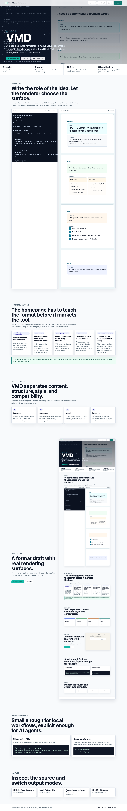
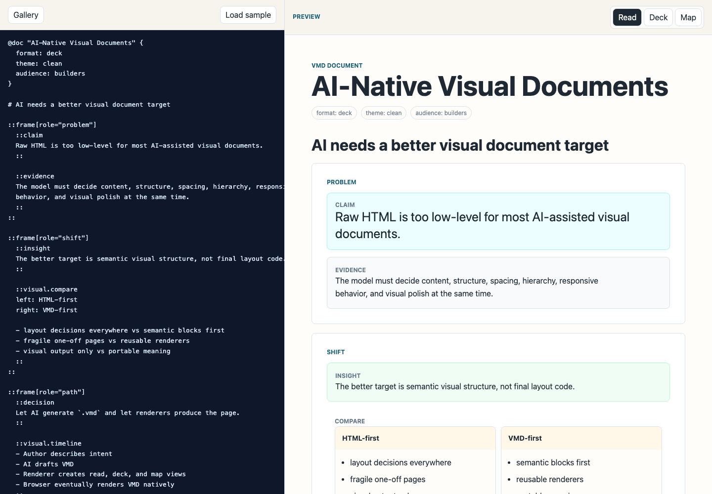

# VMD

VMD is an open draft for a layered visual document format.

The web has languages for structure, style, and behavior. VMD explores a missing
layer: a portable way to describe the role of an idea so the same source can
become a document, deck, map, report, or interactive page.

## Purpose

VMD is designed for a world where people and AI agents create visual documents
together. Instead of forcing every AI-assisted creator to generate complete
HTML, CSS, and JavaScript for every page, VMD gives them a smaller and more
portable target: layered visual structure.

The format is not an HTML wrapper. It is a readable source format for visual
documents, with preservation features available when exact browser output
matters.

## Core Idea

```text
Write like Markdown.
Structure like HTML.
Render through a theme system like CSS.
```

VMD marks the role of an idea instead of its final decoration:

```vmd
::claim
This product is not an allowance tracker.
It is a family behavior-change system.
::
```

That semantic block can become a section in read mode, a slide in deck mode, or
a node in map mode.

For high-fidelity import, VMD also has layout, style, component, and raw
compatibility layers. That means a `.vmd` file can be either a clean semantic
document or a preserved browser page:

```vmd
@doc "Imported Page" {
  fidelity: preserve
}

::raw.css
body { margin: 0; }
::

::raw.html
<main>
  <h1>Preserved browser output</h1>
</main>
::
```

## Why VMD

Markdown made writing portable. HTML made documents linkable and structured.
CSS made presentation reusable. JavaScript made the web programmable.

VMD focuses on:

```text
semantic intent plus explicit visual fidelity
```

Most authoring tools store appearance. VMD stores meaning first. A renderer can
then decide how that meaning should appear in each medium.

## Why This Matters For AI-Assisted Creation

AI can generate HTML, CSS, and JavaScript, but polished visual documents require
many low-level layout decisions. VMD gives AI-assisted creators and vibe coders
a higher-level target:

```text
describe the document's semantic structure,
then let the renderer handle the visual page.
```

An author can ask for a `.vmd` document. The browser, extension, app, or renderer
can turn that semantic source into a web-native visual page.

## Browser Polyfill

This repository provides a Chrome-based browser polyfill for `.vmd` files.

Current behavior:

- local `.vmd` files opened in Chrome can render automatically through the
  extension content script
- the extension popup also includes a manual viewer with upload and drag-and-drop
- the same source can render as read, deck, and map views
- `fidelity: preserve` documents render without the extension toolbar or VMD
  body classes, and can preserve supported `html`/`body` attributes so imported
  HTML/CSS can match the original page more closely

## Repository Contents

- `docs/quickstart.md`: fastest path from source to rendered output
- `docs/manifesto.md`: why this format should exist
- `docs/architecture.md`: source, AST, renderer, and extension architecture
- `docs/cli.md`: command-line rendering, AST, validation, and gallery workflow
- `docs/ast-schema.md`: draft JSON Schema for the layered AST
- `docs/public-site-and-actions.md`: GitHub Pages and reusable render action
- `docs/language-design.md`: language direction and design principles
- `docs/spec-draft-v0.md`: first public grammar and AST draft
- `docs/format-benchmark.md`: VMD vs Markdown vs HTML benchmark results
- `docs/open-design-ai-artifact-benchmark.md`: Open Design AI artifact benchmark
- `docs/visual-fidelity.md`: how to verify existing HTML-to-VMD visual drift
- `docs/ai-authoring-guide.md`: how to use VMD as an AI generation target
- `docs/browser-integration.md`: Chrome extension rendering behavior
- `docs/extension-architecture.md`: current extension design
- `docs/testing.md`: local and integration test workflow
- `docs/release.md`: release and packaging workflow
- `samples/family-platform.vmd`: sample VMD source
- `samples/visual-fidelity-layers.vmd`: layered fidelity and raw compatibility example
- `extension/`: reference Chrome polyfill and viewer
- `vscode-extension/`: VS Code authoring and preview extension
- `core/`: shared parser and renderer runtime
- `tools/render-html.mjs`: local renderer that converts a VMD file to static HTML
- `tools/verify-vmd-fidelity.mjs`: Playwright-based visual drift checker for HTML-to-VMD conversion
- `bin/vmd.mjs`: CLI for rendering, AST output, validation, and gallery builds
- `schemas/vmd-ast.schema.json`: draft AST JSON Schema

## Format Preview

```vmd
@doc "Document title" {
  format: deck
  theme: clean
}

# Main title

::frame[role="opening"]
  ::claim
  Core claim text.
  ::

  ::evidence
  Supporting evidence.
  ::
::
```

## Reference Browser Polyfill

The Chrome extension is a reference implementation, not the definition of the
format.

Automatic local file rendering:

1. Open `chrome://extensions`
2. Enable `Developer mode`
3. Click `Load unpacked`
4. Select the `extension/` directory
5. Open the extension details page
6. Enable `Allow access to file URLs`
7. Open or drag a local `.vmd` file into Chrome

Manual viewer:

- opening a VMD viewer tab from the extension popup
- uploading a `.vmd` file
- dragging and dropping a `.vmd` file
- rendering read, deck, and map modes from the same source
- showing validator diagnostics for the loaded source
- loading packaged semantic and layered sample documents

Package the Chrome extension:

```bash
npm run package:chrome
```

The zip is written to:

```text
dist/vmd-chrome-extension.zip
```

## VS Code Extension

The VS Code extension is the authoring-side companion for VMD.

It supports:

- `.vmd` language detection
- syntax highlighting
- block folding
- semantic block snippets
- validator diagnostics
- `VMD: Open Preview`
- `VMD: Open Preview to Side`
- `Open With... VMD Preview`
- live preview updates from the active document

Package the extension:

```bash
npm run package:vscode
```

The VSIX is written to:

```text
dist/vmd-vscode.vsix
```

## Extension Tests

Run the shared checks:

```bash
npm run check
```

Run the Chrome extension integration test:

```bash
npm run test:chrome
```

Run the VS Code extension integration test:

```bash
npm run test:vscode
```

## Local Static Render

Requires Node.js 18 or newer.

```bash
npm run render:sample
```

The output is written to:

```text
dist/family-platform.html
```

## CLI

The reference CLI can render HTML, print the layered AST, validate source, and
build the public gallery.

```bash
node bin/vmd.mjs validate samples/family-platform.vmd
node bin/vmd.mjs validate samples/family-platform.vmd --strict
node bin/vmd.mjs validate samples/family-platform.vmd --json
node bin/vmd.mjs ast samples/family-platform.vmd
node bin/vmd.mjs render samples/family-platform.vmd --out dist/family-platform.html --mode deck
node bin/vmd.mjs gallery --out dist/site
```

See `docs/cli.md`.

## Public Gallery

Production site:

```text
https://vmd-sandy.vercel.app/
```

Build the static gallery and playground:

```bash
npm run build:site
```

The output is written to:

```text
dist/site/
```

The repository also includes Vercel configuration, a GitHub Pages workflow, and
a reusable local GitHub Action for rendering `.vmd` files.

## Screenshots





## Draft Vocabulary

Semantic blocks:

- `frame`: one unit of thought
- `claim`: primary argument
- `evidence`: supporting proof or context
- `insight`: interpretation or discovery
- `decision`: selected direction
- `action`: next step

Visual blocks:

- `visual.compare`
- `visual.loop`
- `visual.timeline`
- `visual.matrix`

Layout blocks:

- `layout.stack`
- `layout.grid`
- `layout.split`
- `layout.cluster`
- `layout.panel`
- `layout.device`
- `layout.tabs`

Component blocks:

- `component.card`
- `component.metric`
- `component.persona`
- `component.phone`
- `component.token-table`
- `component.browser`

Compatibility blocks:

- `style.tokens`
- `style.css`
- `raw.html`
- `raw.css`
- `raw.svg`
- `raw.js` (parsed but not executed)

See `docs/spec-draft-v0.md` for the current draft.

## Samples

- `samples/family-platform.vmd`: deck example
- `samples/ai-native-brief.vmd`: AI-native visual document argument
- `samples/lesson-outline.vmd`: education/lesson example
- `samples/visual-fidelity-layers.vmd`: layout, style, component, and raw preservation example

## Current Status

VMD is an experimental draft. The important boundary is the layered AST. VMD
source should compile into a structured representation before it becomes HTML,
slides, PDF, or any other output format.

## Contributing

The format should stay small, readable, and renderer-independent.

Good contributions include:

- sample `.vmd` documents
- proposed semantic block definitions
- parser and AST improvements
- renderer experiments
- theme systems
- accessibility and portability feedback
